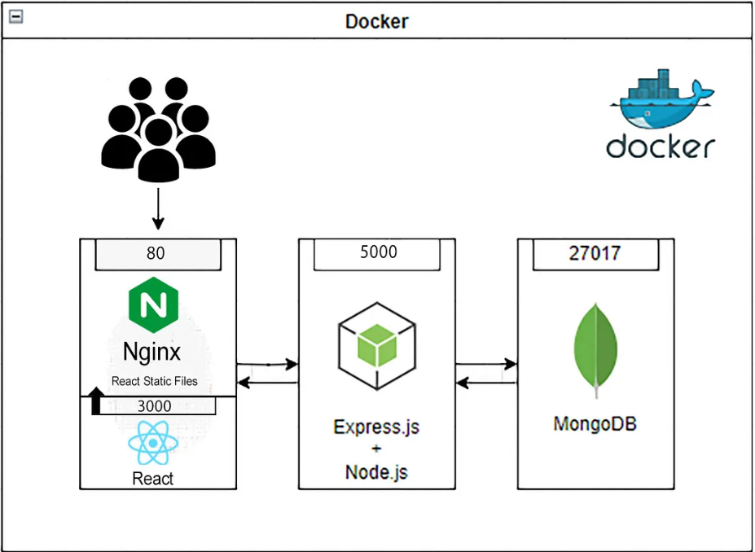

# Containerizing a Full-Stack Web App

## Introduction :
Docker is an open platform for developing, shipping, and running applications.

Docker allows you to separate your applications from your infrastructure so you can deliver software quickly. With Docker, you can manage your infrastructure in the same ways you manage your applications.

By taking advantage of Docker’s methodologies for shipping, testing, and deploying code quickly, you can significantly reduce the delay between writing code and running it in production.

## Objective :
The main purpose of this application is to containerize a full-stack JavaScript application using Docker and Docker Compose.

## Prerequisites
- [Docker installed](https://docs.docker.com/get-started/get-docker/)
- Basic understanding of Kubernetes and Docker

## Installation

This project has been containerized using Docker. Follow these steps:

1. Clone the repository:
    ```sh
    git clone https://github.com/zakaria-hammal/Docker-App.git
    cd Docker-App
    ```
2. Run : 
    ```sh
    docker compose up --build
    ```
3. To shut down the application, run just press Crtl + C, and to run it again, do :
    ```sh
    docker compose up
    ```

## Overview
### Project architecture :
1. MongoDB : a nosql database thar runs inside its own container at port 27017.
2. Backend : created with nodejs, connects to the database , and when  receiving a get request at "/titles" send a random title, connected to port 5000.
3. Frontend : that uses nginx to serve a react app.
4. Docker volumes : to persist the MongoDb database, and an mongo-init.js to seed the database with mock data.
3. Docker network : a virtual LAN that allow containers to communicate and discover each other by name.



### Troubleshooting :
When creating this app, I encoutred some problems 
    - **Backend and Mongodb running at the same time :** when running docker-compose, the backend container and mongo container start at the same time, which may cause problems because the backend connects to the databse before it completly started .
        **Solution :** I used depends on with _condition : service_healthy_, so that the backend doesn't start until the database has completely started.
    - **Fetch failed from the Frontend :** the fetch failed when trying to send request from frontend to backend because the nodejs server didn't allow requests from different domains/ports/protocol.
        **Solution :** using CORS (Cross-Origin Resource Sharing) in the server.